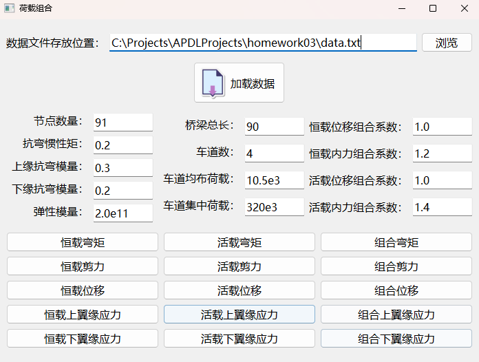

# APDLData 桥梁内力组合分析工具

  （如需展示界面截图，可替换路径）

## 📌 项目简介

本项目是一个基于 Python 的桥梁结构内力组合分析工具，支持从 ANSYS APDL 输出的数据文件中读取位移、弯矩和剪力影响线，并结合车道荷载进行恒载和活载计算，最终生成组合包络图。

项目采用 PyQt5 实现图形用户界面，Matplotlib 进行绘图，适用于教学、桥梁分析科研与辅助设计。

## 🧠 功能特色

- 从结构分析程序导出的数据中提取响应矩阵（位移、弯矩、剪力）
- 支持恒载分析、活载包络分析和组合荷载分析
- 图形界面可输入自定义参数：节点数、几何信息、材料参数、车道数与荷载
- 一键绘制 15 种结构响应曲线，包括：
  - 弯矩、剪力、位移（恒载 / 活载 / 组合）
  - 上下翼缘应力（恒载 / 活载 / 组合）

## 🖥️ 使用方式

### 1. 安装依赖

推荐使用虚拟环境（如 venv）来隔离环境:
```bash
pip install -r requirements.txt
```
如果尚未创建 requirements.txt，也可手动安装:
```bash
pip install numpy matplotlib PyQt5
```
### 2. 启动程序
```bash
python main.py
```
### 3. 加载数据与分析

- 点击“浏览”选择 .txt 数据文件（格式参考下方说明）
- 输入结构参数
- 点击“加载数据” → 完成计算
- 点击右侧任意按钮即可绘图

## 📂 数据文件格式

数据文件为纯文本 .txt 文件，必须满足以下格式：

- 总行数为 N*N 行，列数为 4
- 每一块（连续的 N 行）第一列应一致，表示同一荷载节点
- 每行四列分别为：
  1. 荷载节点编号
  2. 位移响应值
  3. 弯矩响应值
  4. 剪力响应值

示例片段：
```bash
1   0.000032   0.25   -13.2
1   0.000046   0.27   -12.9
...
```
## 📊 示例截图

（推荐添加界面截图到 docs/screenshot.png 或其他位置，并替换此说明）

## 📁 项目结构
```bash
APDLData/
├── main.py              (图形界面主程序)
├── APDLData.py          (核心类，负责数据读取与计算)
├── icons/               (图标资源)
├── dist/ & build/       (打包生成目录，建议加到 .gitignore)
├── venv/                (虚拟环境文件夹，应忽略)
├── README.md
└── .gitignore
```
## 🧪 开发 & 打包建议

- 打包推荐使用 PyInstaller
- 打包命令示例：
```bash
pyinstaller main.py -F -w -i icons/moment.png --name LoadAnalyzer
```


如需进一步文档、样例数据或使用说明，请联系作者。

